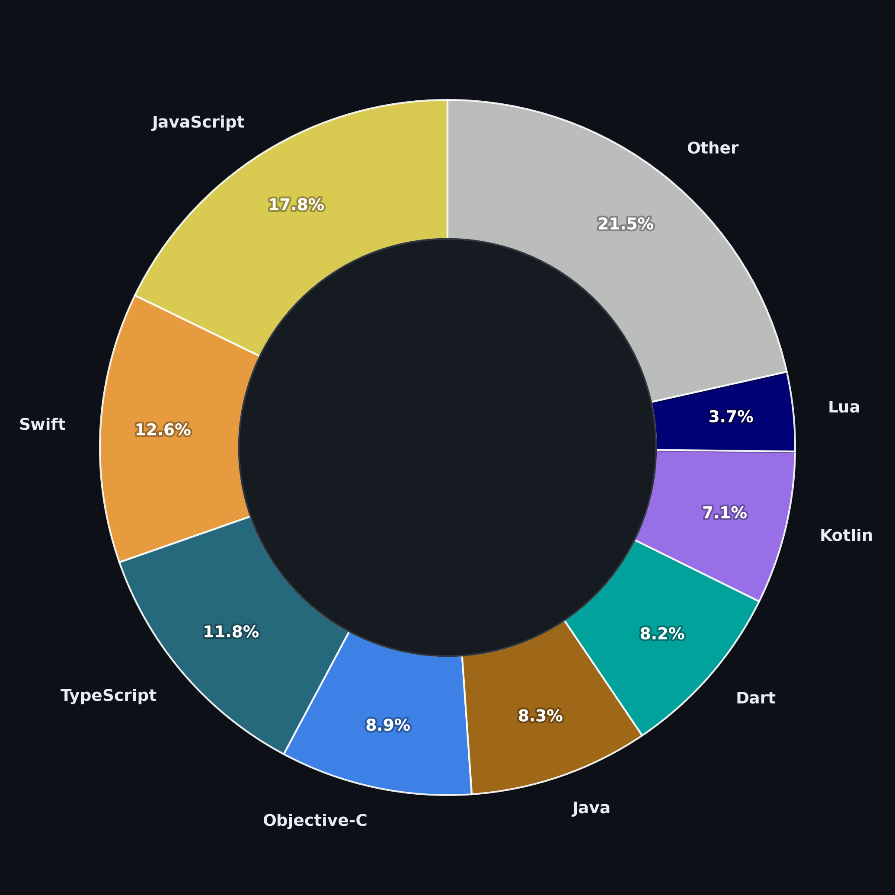

# Matt Mohandiss  
Software Engineer — Evaluation Platforms · Cloud Infrastructure · Human–AI Systems  

Copenhagen, Denmark 🇩🇰  

---

## About Me

I build reliable backend systems and automated evaluation platforms for complex software.

Previously worked in cloud infrastructure and multi-tenant Kubernetes environments, focusing on correctness, regression detection, and operational reliability.  

Currently pursuing an MS in Computer Science at the University of Copenhagen with interests in:

- Human–computer interaction  
- Evaluation of human–AI systems  
- Constraint-based feedback systems  
- ML evaluation and anomaly detection  

---

## 🔬 Selected Work

### Evaluation Frameworks
Designed and integrated automated evaluation systems into CI/CD pipelines to detect regressions and compare system behavior across releases.

### Cloud Platform Engineering
Operated and scaled Kubernetes-based infrastructure in Azure, emphasizing observability, reliability, and secure multi-tenant architecture.

### Manufacturability Feedback (DFM Tool — Early Stage)
Exploring constraint-based geometric analysis for CAD models using OpenCascade to provide automated manufacturability feedback.

### Anomaly Detection Systems
Built LSTM-based time-series anomaly detection pipelines with calibrated evaluation of false positives and thresholds.

---

## 🛠 Tech Focus

**Backend:** Python, Go, Java  
**Cloud & Platform:** Azure, Kubernetes, Terraform, Docker, Helm  
**Data Systems:** PostgreSQL, Elasticsearch, message queues  
**DevOps & CI/CD:** GitHub Actions, release automation, quality gates  
**Observability:** Prometheus, Grafana, SLIs/SLOs  
**Research Interests:** HCI, ML evaluation, automated feedback systems  

---

## 🚀 Currently Exploring

- Interaction design for automated feedback in professional tools  
- Human–AI evaluation methods  
- Scalable ML evaluation infrastructure  
- Early-stage startup ideas in design and manufacturability  

---

## 📄 Resume

Full resume:  
👉 https://mattmohandiss.com/resume  

---

## 📫 Contact

Email: mattmohandiss@gmail.com  
LinkedIn: https://linkedin.com/in/mattmohandiss/
