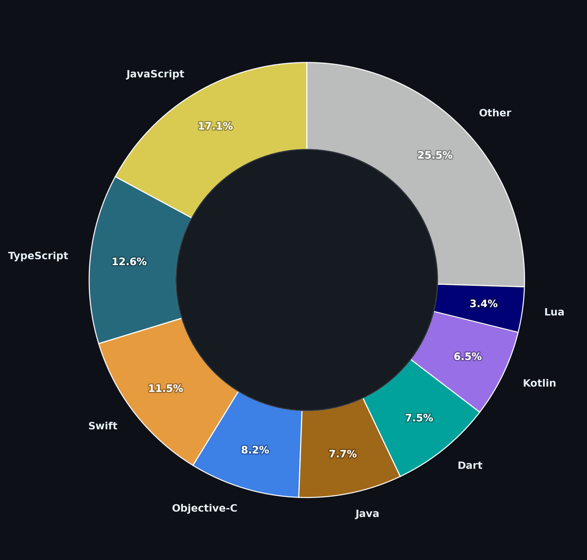

### 🧑🏽 About Me

Currently pursuing an MS in Computer Science at the University of Copenhagen with interests in:
- Human–computer interaction
- Evaluation of human–AI systems
- Constraint-based feedback systems
- ML evaluation and anomaly detection

### 🛠 Tech Focus
- **Backend:** Python, Go, Java  
- **Cloud & Platform:** Azure, Kubernetes, Terraform, Docker, Helm  
- **Data Systems:** PostgreSQL, Elasticsearch, message queues  
- **DevOps & CI/CD:** GitHub Actions, release automation, quality gates  
- **Observability:** Prometheus, Grafana, SLIs/SLOs  
- **Research Interests:** HCI, ML evaluation, automated feedback systems  

 

### 🚀 Currently Exploring
- Interaction design for automated feedback in professional tools  
- Human–AI evaluation methods  
- Scalable ML evaluation infrastructure  

### 📫 Contact
[Website](https://mattmohandiss.com) · [Resume](https://mattmohandiss.com/resume) · [LinkedIn](https://linkedin.com/in/mattmohandiss/) · [Email](mailto:mattmohandiss@gmail.com)
